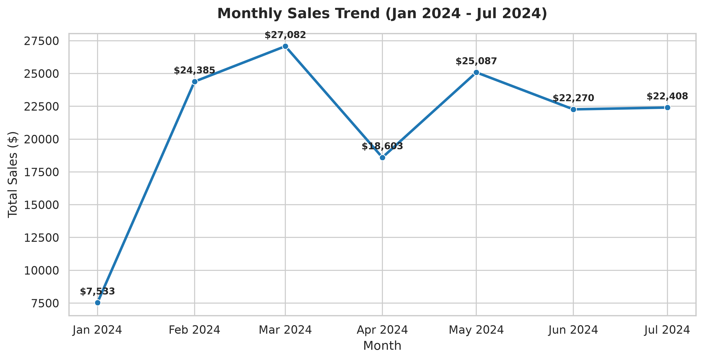
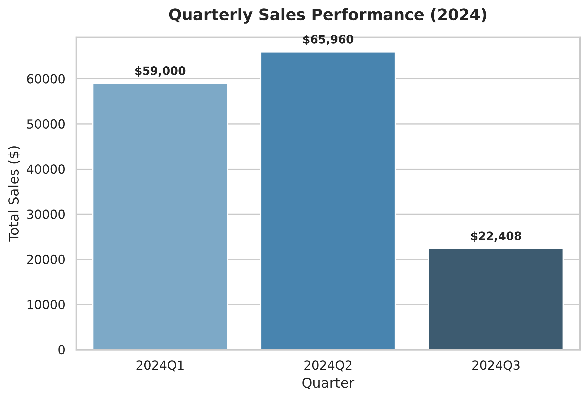
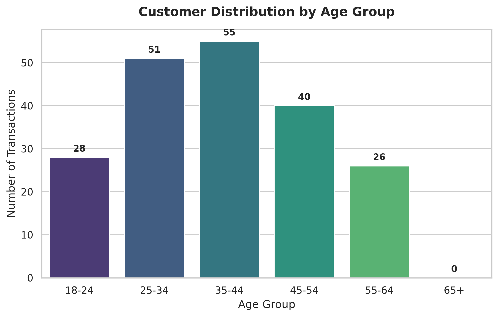
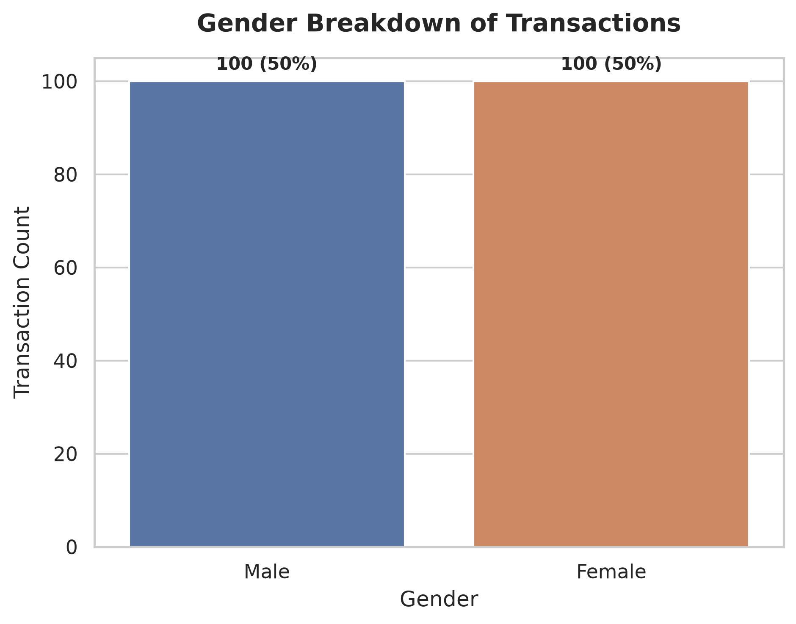
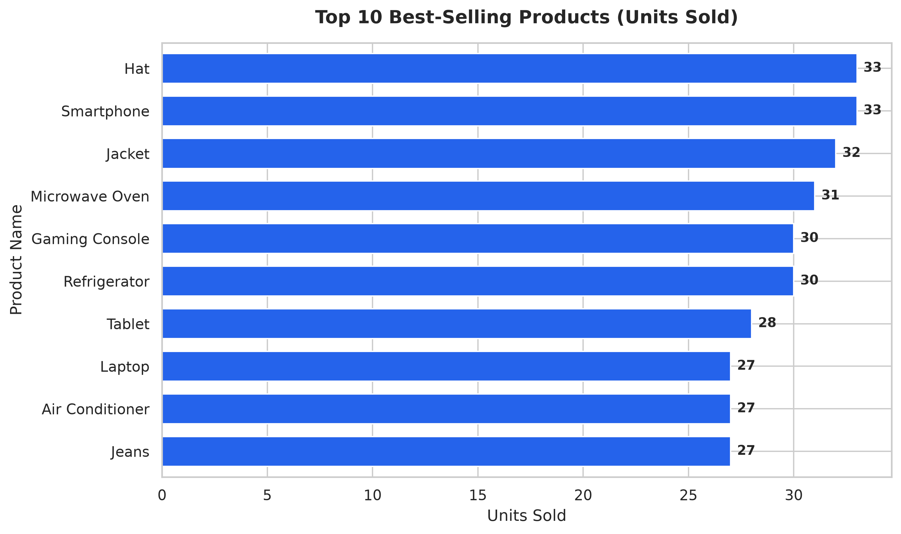
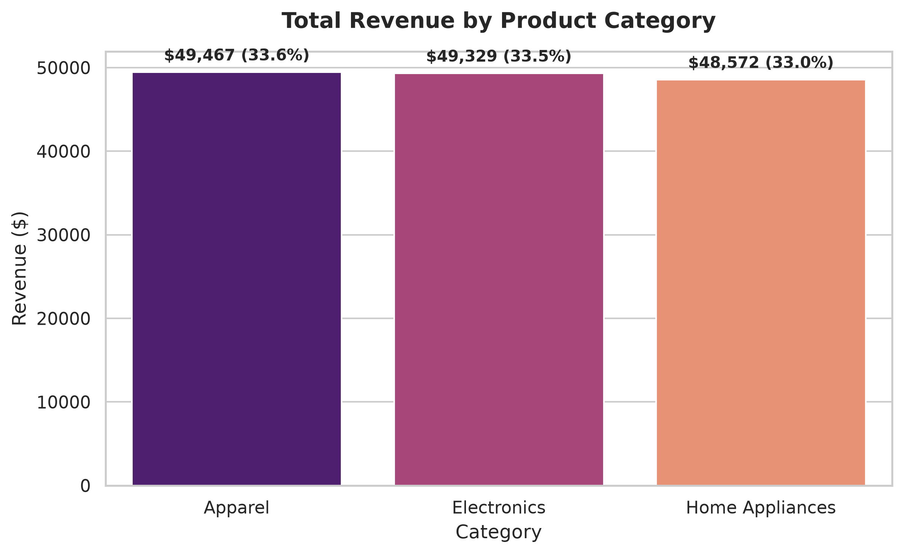
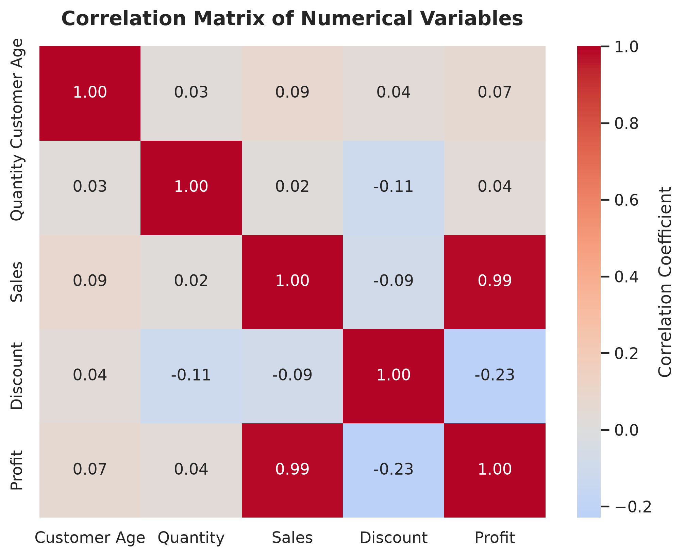
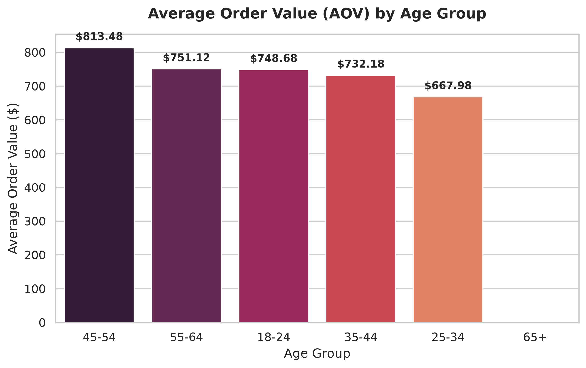

# Oasis Infobyte SIP — Data Analytics Internship
## Task 1: Exploratory Data Analysis (EDA) on Retail Sales Data


---

## 📌 Executive Summary

This project delivers an end-to-end **Exploratory Data Analysis (EDA)** on retail transactional records using the **Global Retail Solutions** dataset. The primary objective is to uncover sales performance patterns, evaluate customer demographic dynamics, benchmark departmental product lines, assess price discounting behavior, and provide senior management with **three actionable, data-backed business recommendations**.

---

## 📂 Repository Structure

```text
OIBSIP/
└── Data-Analytics-Level1-Task1-Retail-Sales-EDA/
    ├── OIBSIP_Task1_Retail_EDA.ipynb   # Fully executed Jupyter Notebook with outputs & markdown
    ├── README.md                       # Detailed project documentation & analysis report
    ├── retail_sales.csv                # Clean retail transaction dataset (200 rows, 12 cols)
    └── images/                         # High-resolution saved visualization artifacts
        ├── monthly_sales_trend.png
        ├── quarterly_sales_trend.png
        ├── age_group_distribution.png
        ├── gender_breakdown.png
        ├── top10_products.png
        ├── category_revenue.png
        ├── correlation_heatmap.png
        └── aov_by_age_group.png
```

---

## 📊 Dataset Overview

- **Source:** [Global Retail Solutions — Kaggle](https://www.kaggle.com/datasets/patrickkimunyi/global-retail-solutions) (Author: Patrick Kimunyi)
- **Granularity:** Transaction-level retail sales across global regions.
- **Records & Dimensions:** 200 rows × 12 columns.
- **Data Quality:** 100% complete records (**0 null / missing values**) and **0 duplicate entries**.

### Feature Schema

| Field Name | Type | Description |
| :--- | :--- | :--- |
| `Product Category` | Categorical | Department classification (`Electronics`, `Apparel`, `Home Appliances`) |
| `Product Name` | Categorical | Specific merchandise item (`Smartphone`, `Laptop`, `Refrigerator`, etc.) |
| `REGION` | Categorical | Global territory where order was fulfilled (`AMERICAS`, `EUROPE`, `ASIA`) |
| `Sales Amount` / `Sales`| Numerical | Gross monetary value of transaction ($20.00 to $1,499.00) |
| `Quantity` | Numerical | Number of units purchased per transaction (1 to 4 units) |
| `Order Date` | Datetime | Timestamp of sale (January 10, 2024 to July 27, 2024) |
| `Customer ID` | Categorical | Unique customer identifier |
| `Customer Age` | Numerical | Age of purchasing consumer (18 to 60 years) |
| `Customer Gender` | Categorical | Gender of customer (`Male`, `Female`) |
| `Discount` | Numerical | Discount rate applied in decimal format (0.05 to 0.30) |
| `Profit` | Numerical | Net earnings generated post-discount ($15.40 to $1,379.08) |

---

## 📈 Key Findings & Visualizations

### 1. Descriptive Statistics & Data Characteristics

```text
       Sales Amount    Quantity   Customer Age      Discount        Profit
count    200.000000  200.000000     200.000000    200.000000    200.000000
mean     736.840000    2.425000      39.145000      0.174700    610.809850
std      443.182443    1.162381      11.841392      0.070980    376.686834
min       20.000000    1.000000      18.000000      0.050000     15.400000
50%      705.500000    2.000000      37.500000      0.185000    588.000000
max     1499.000000    4.000000      60.000000      0.300000   1379.080000
```

- **Distribution Skewness:** Mean sales ($736.84) slightly exceeds median sales ($705.50), reflecting a moderate positive skew driven by high-ticket electronics and appliances.
- **Order Sizes:** Median order quantity is **2.0 units** (std = 1.16), with a ceiling of 4 units per transaction.
- **Profit Realization:** Average profit stands at **$610.81**, preserving an overall gross profit margin of **82.9%** across all fulfilled transactions.

---

### 2. Time-Series Analysis: Monthly & Quarterly Trajectory



- **Monthly Performance:**
  - **Peak Month:** **March 2024** achieved record monthly sales of **$27,082.00**, closely followed by **May 2024** ($25,087.00) and **February 2024** ($24,385.00).
  - **Trough Month:** **January 2024** registered the lowest revenue (**$7,533.00**), reflecting post-holiday demand reset and initial dataset tracking ramp-up.
  - **Run-Rate Stability:** Between February and July, monthly sales remained remarkably consistent within the **$22,000–$25,000 range**.



- **Quarterly Performance:**
  - **2024 Q2 (April–June)** delivered the highest performance with **$65,960.00** in total sales, representing an **11.8% expansion** over **2024 Q1 ($59,000.00)**.
  - **2024 Q3 ($22,408.00)** reflects strong continuity through July.

---

### 3. Customer Demographics: Age Cohorts & Gender Breakdown



- **Core Demographic (25–44 Years):** The **35–44 age group** is the largest transaction contributor (**55 transactions / 27.5%**), closely followed by the **25–34 age group** (**51 transactions / 25.5%**). Together, these cohorts represent **53.0% of all customer transactions**.
- **Secondary Demographics:** Ages 45–54 represent **20.0% (40 orders)**, ages 18–24 contribute **14.0% (28 orders)**, and ages 55–64 represent **13.0% (26 orders)**.



- **Gender Parity:** The customer base is split **exactly 50.0% Male (100 orders) and 50.0% Female (100 orders)**, indicating universal catalog appeal across gender segments.

---

### 4. Product & Category Revenue Breakdown



- **Unit Parity vs. Revenue Disparity:** Top-selling products by quantity display near-uniform volumes (Smartphones: 33, Hats: 33, Jackets: 32, Microwaves: 31, Refrigerators: 30).
- However, monetary value is heavily concentrated:
  - **Refrigerators:** **$36,000.00** (30 units @ $1,200 avg)
  - **Air Conditioners:** **$21,600.00** (27 units @ $800 avg)
  - **Laptops:** **$21,600.00** (27 units @ $800 avg)
  - **Smartphones:** **$16,500.00** (33 units @ $500 avg)
  - *Contrast:* Hats (33 units) generated **$495.00** in total sales.



- **Balanced Portfolio:** Total turnover ($147,368.00) is almost equally divided into three balanced shares:
  - **Apparel:** $49,467.00 (33.57%)
  - **Electronics:** $49,329.00 (33.47%)
  - **Home Appliances:** $48,572.00 (32.96%)
- This balanced structure protects the business from sector-specific supply or demand shocks.

---

### 5. Correlation & Driver Analysis



| Variable Pair | Correlation (*r*) | Interpretation |
| :--- | :---: | :--- |
| **Sales & Profit** | **+0.986** | Near-perfect positive linear relationship; revenue volume directly translates into net dollar margin. |
| **Discount & Profit** | **-0.229** | Statistically significant negative correlation; discounting reduces net profit margins. |
| **Discount & Sales** | **-0.086** | Weak negative correlation; higher discount rates **fail** to induce higher sales dollars. |
| **Quantity & Sales** | **+0.021** | Negligible correlation; overall transaction value is governed by SKU unit price rather than unit count. |
| **Customer Age & Sales**| **+0.087** | Minimal linear correlation; spending occurs across age brackets with cohort-specific basket variations. |

---

### 6. Non-Obvious Insight: AOV Disparity Across Demographics



- **The Volume vs. Value Paradox:**
  - The **35–44 cohort** generates the most transactions (55 orders), but an average order value of **$732.18**.
  - The **45–54 cohort** produces the **highest Average Order Value ($813.48)**, followed by the **55–64 cohort ($751.12)**.
  - The **25–34 cohort** records the **lowest AOV ($667.98)** despite high order frequency (51 orders).
- **Executive Takeaway:** Prioritizing marketing strictly by transaction count overlooks mature consumers (ages 45–64) who possess higher purchasing power and buy high-ticket appliances and electronics.

---

## 📌 Business KPI Summary

| Performance Metric | Calculated Value |
| :--- | :--- |
| **Total Gross Revenue** | **$147,368.00** |
| **Total Net Profit** | **$122,161.97** |
| **Overall Net Profit Margin** | **82.90%** |
| **Average Order Value (AOV)** | **$736.84** |
| **Total Units Sold** | **485 units** |
| **Unique Customers Served** | **200 customers** |
| **Average Applied Discount** | **17.47%** |

---

## 🚀 Actionable Business Recommendations

### 1. Eliminate Blanket Discounts in Favor of Margin-Protected Bundling
- **Empirical Finding:** Discount rate negatively impacts profit (*r* = -0.229) with zero positive lift on gross sales (*r* = -0.086).
- **Execution Plan:**
  - Cap baseline price discounts at 10%–12% (down from peak rates of 30%).
  - Shift promotional strategy toward cross-category bundling: bundle high-margin apparel accessories (e.g., Hats, Jackets) with high-ticket Electronics (Laptops, Smartphones) to raise basket size without eroding appliance profit margins.

### 2. High-AOV Demographic Targeting (45–64 Cohorts)
- **Empirical Finding:** Customers aged 45–54 drive the highest AOV (**$813.48**), outspending 25–34 shoppers by **$145.50 per order**.
- **Execution Plan:**
  - Launch dedicated campaigns targeting the 45–64 demographic featuring premium Home Appliances (Refrigerators, Air Conditioners) and flagship computing devices, highlighting extended warranties and energy efficiency.
  - Retain high-frequency, budget-friendly lifestyle promotions for the 25–44 volume cohorts to sustain baseline order flow.

### 3. Pre-Q2 Inventory Buffering & High-Impact SKU Prioritization
- **Empirical Finding:** 2024 Q2 generated **$65,960.00 (+11.8% vs Q1)** with steady peaks in March ($27,082) and May ($25,087). Refrigerators ($36,000), Air Conditioners ($21,600), and Laptops ($21,600) generate **53.7% of total company revenue**.
- **Execution Plan:**
  - Advance inventory procurement timelines into January/February to build safety buffers before the Q2 demand peak.
  - Implement real-time stock alert thresholds for top 4 revenue drivers to eliminate stockout risks during peak buying windows.

---

## 🛠️ How to Run the Project Locally

### Prerequisites
- Python 3.10+ (tested on Python 3.13)
- Jupyter Notebook or VS Code Jupyter Extension

### Setup & Execution

```bash
# 1. Clone the repository
git clone https://github.com/<your-username>/OIBSIP.git
cd OIBSIP/Data-Analytics-Level1-Task1-Retail-Sales-EDA

# 2. Create and activate a virtual environment (optional but recommended)
python -m venv venv
# On Windows:
.\venv\Scripts\activate
# On macOS/Linux:
source venv/bin/activate

# 3. Install required libraries
pip install pandas numpy matplotlib seaborn ipykernel nbformat nbclient

# 4. Launch Jupyter Notebook
jupyter notebook OIBSIP_Task1_Retail_EDA.ipynb
```

---

## ✅ Submission Checklist

- [x] Dataset loaded and inspected
- [x] Shape, dtypes, and null values checked (200 rows, 12 columns, 0 nulls)
- [x] Mean, median, mode, and standard deviation calculated for all numerical fields
- [x] Monthly sales trend plotted and analyzed (Peak: March $27,082 | Low: January $7,533)
- [x] Quarterly sales trend plotted and analyzed (Strongest: Q2 at $65,960)
- [x] Age-group distribution plotted (Largest: 35–44 cohort at 27.5%)
- [x] Gender breakdown plotted (50% Male / 50% Female parity)
- [x] Top 10 products plotted by volume & evaluated by revenue impact
- [x] Revenue by category plotted (Apparel: 33.6%, Electronics: 33.5%, Home Appliances: 33.0%)
- [x] Correlation heatmap created and interpreted (Sales/Profit *r* = +0.99, Discount/Profit *r* = -0.23)
- [x] Additional non-obvious visualization created (AOV by Age Group: 45–54 highest at $813.48)
- [x] Markdown observations written with actual numbers after every chart
- [x] At least 3 actionable business recommendations written
- [x] Notebook saved and screenshots captured
- [x] README.md added to the OIBSIP task folder

---

## 👤 Author
- **Intern:** Oasis Infobyte SIP Intern
- **Track:** Data Analytics
- **Task:** Level 1 — Task 1: EDA on Retail Sales Data
