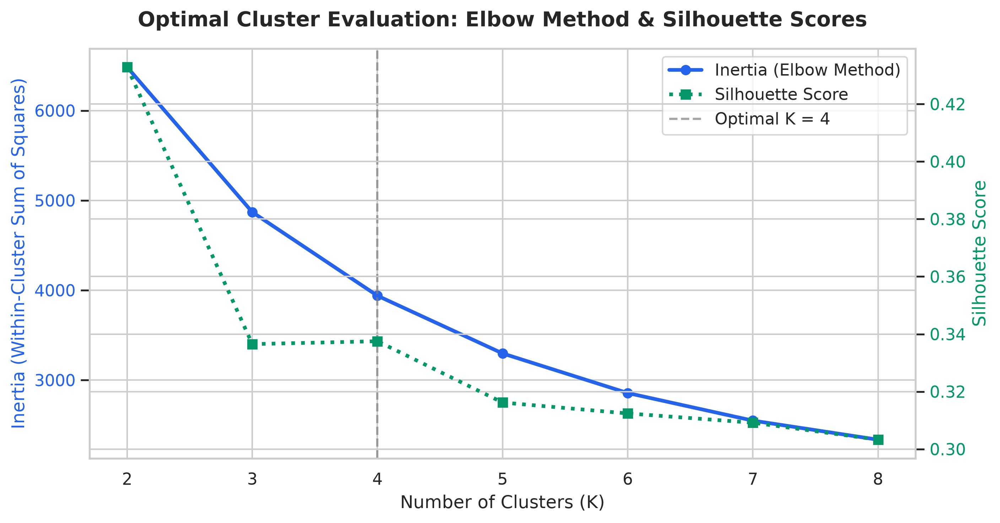
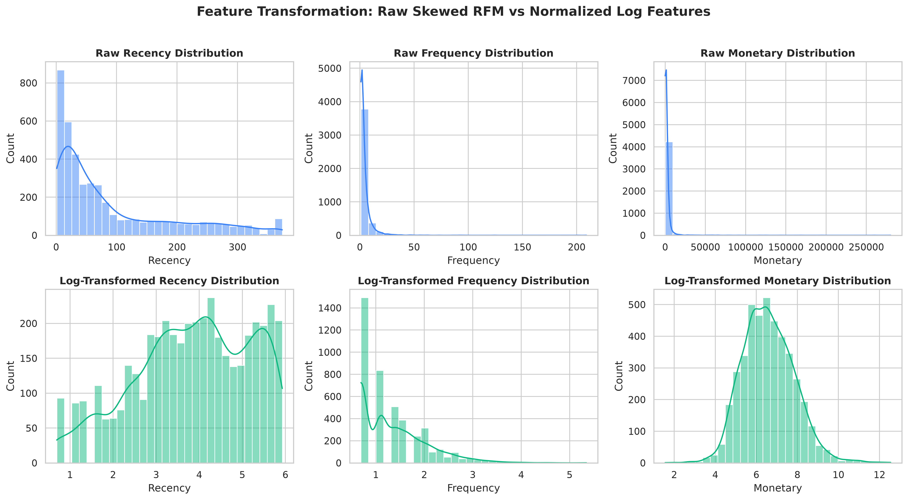
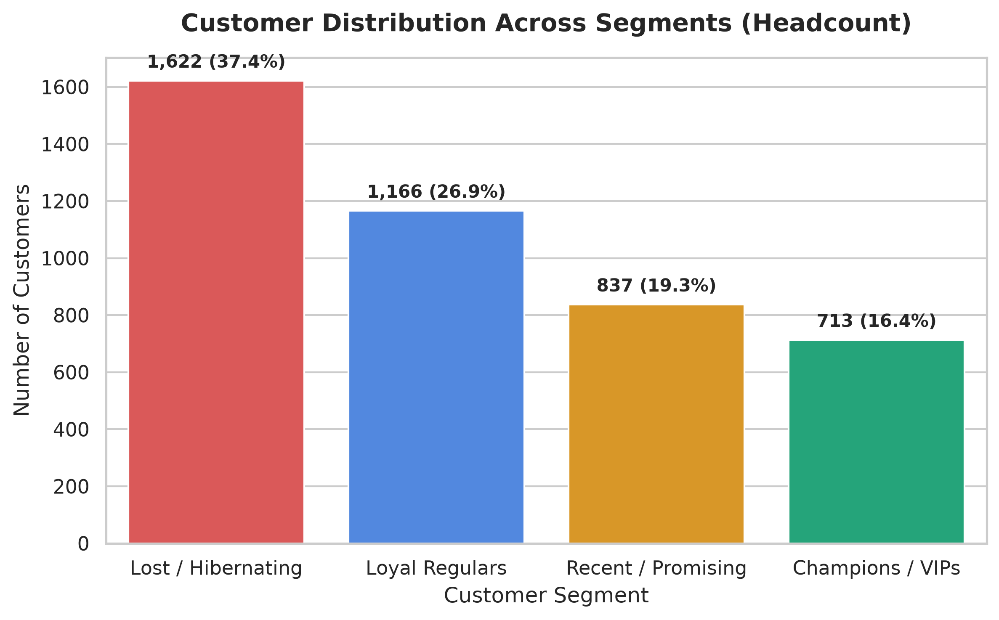
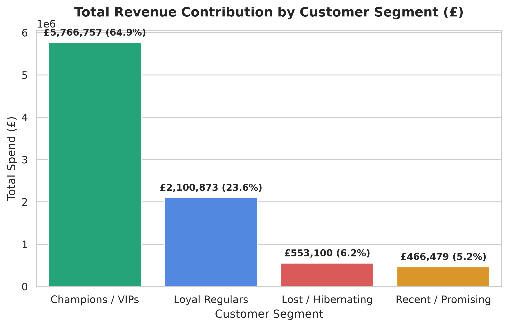
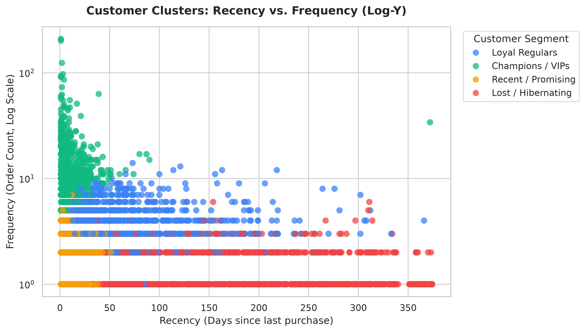
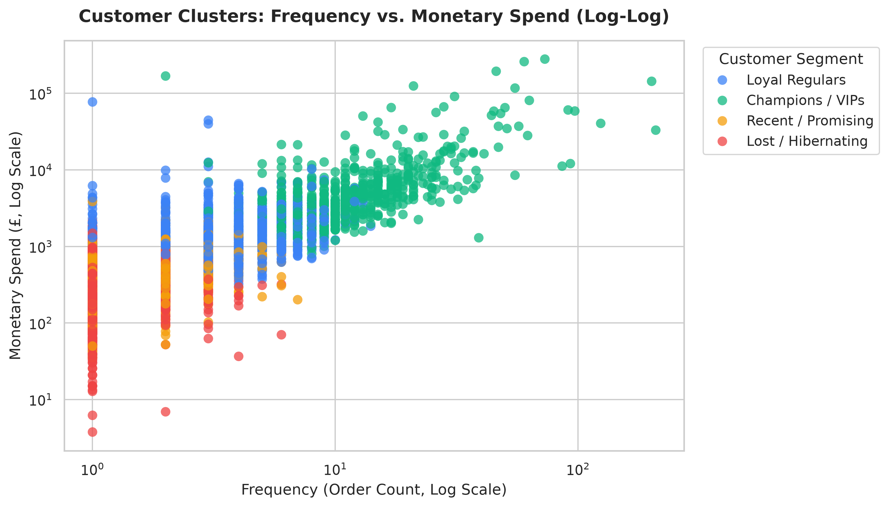
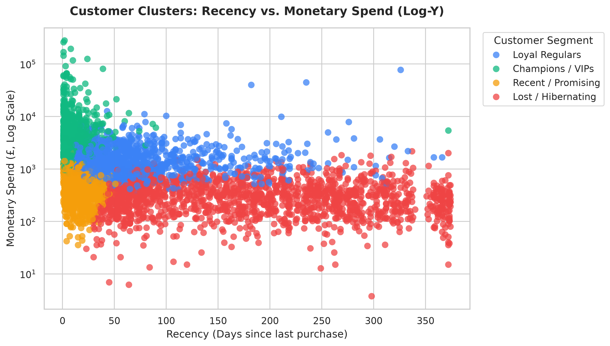
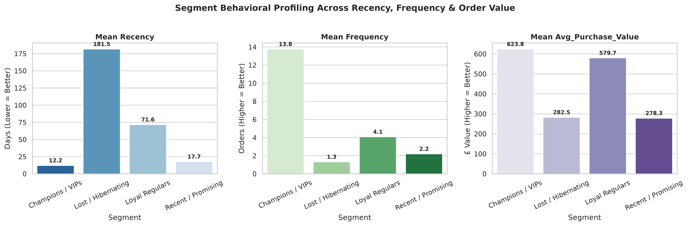

# Oasis Infobyte SIP — Data Analytics Internship
## Task 2: Customer Segmentation Analysis (RFM & K-Means Clustering)


---

## 📌 Executive Summary

Customer segmentation is the cornerstone of modern retail and e-commerce growth strategies. Treating an entire customer base as a homogenous audience leads to inefficient ad spend, poor retention, and diluted messaging.

This project implements an end-to-end **Customer Segmentation Pipeline** using the **Online Retail Dataset** (532k+ transactional records). By engineering **RFM (Recency, Frequency, Monetary)** dimensions, addressing distribution skewness through log transformation and standard scaling, and applying **K-Means Clustering** ($K = 4$, validated via the **Elbow Method** and **Silhouette Analysis**), we segment **4,338 unique customers** into four distinct, commercially actionable personas.

---

## 📂 Repository Structure

```text
OIBSIP/
└── Data-Analytics-Level1-Task2-Customer-Segmentation/
    ├── OIBSIP_Task2_Customer_Segmentation.ipynb   # Fully executed Jupyter Notebook with outputs & plots
    ├── README.md                                  # Detailed project documentation & marketing playbook
    ├── online_retail.csv                          # Transaction dataset (532,619 records)
    └── images/                                    # 8 High-resolution (300 DPI) chart artifacts
        ├── elbow_silhouette_analysis.png
        ├── rfm_distributions.png
        ├── scatter_recency_frequency.png
        ├── scatter_frequency_monetary.png
        ├── scatter_recency_monetary.png
        ├── cluster_customer_count.png
        ├── cluster_revenue_share.png
        └── cluster_radar_profiling.png
```

---

## 📊 Dataset Overview

- **Source:** [Online Retail Dataset — UCI Machine Learning Repository](https://archive.ics.uci.edu/dataset/352/online+retail)
- **Granularity:** Transactional line-items from a UK-based non-store online retailer.
- **Observation Period:** December 1, 2010 to December 9, 2011 (1 year).
- **Raw Dimensions:** 532,619 transactions × 8 attributes (`InvoiceNo`, `StockCode`, `Description`, `Quantity`, `InvoiceDate`, `UnitPrice`, `CustomerID`, `Country`).

---

## 🧹 Data Cleaning & Hygiene Pipeline

| Filter Applied | Raw Count | Filtered Count | Rationale |
| :--- | :---: | :---: | :--- |
| **Missing CustomerID** | 532,619 | 397,924 | Unauthenticated guest checkout sessions lack persistent customer tracking. |
| **Cancelled Orders** | 397,924 | 397,924 | Exclude invoices prefixed with 'C' (cancellations/returns). |
| **Invalid Quantities & Prices** | 397,924 | 397,884 | Filter for strictly positive records (`Quantity > 0` and `UnitPrice > 0`). |
| **Duplicate Records** | 397,884 | **392,692** | 5,192 identical log entries removed to avoid artificial frequency inflation. |

---

## 📐 Feature Engineering: RFM & CLV Proxy

Each customer account is transformed into core behavioral dimensions:
- **Recency ($R$):** Elapsed days from customer's latest purchase to analysis reference date (December 10, 2011).
- **Frequency ($F$):** Total count of unique completed orders (`InvoiceNo`).
- **Monetary ($M$):** Cumulative historical monetary spend over the observation window.
- **Average Purchase Value ($APV$):** $Monetary / Frequency$.
- **Historical CLV Proxy:** Cumulative spend over the 1-year window. *(Note: Transaction logs lack multi-year retention curves, making historical spend the empirical proxy for lifetime value).*

### Descriptive Statistics of Engineered Features (4,338 Customers)

| Metric | Mean | Std Dev | Min | 25% | Median | 75% | Max | Skewness |
| :--- | :---: | :---: | :---: | :---: | :---: | :---: | :---: | :---: |
| **Recency (days)** | 92.54 | 100.01 | 1.00 | 18.00 | 51.00 | 142.00 | 374.00 | 1.25 |
| **Frequency (orders)**| 4.27 | 7.70 | 1.00 | 1.00 | 2.00 | 5.00 | 209.00 | 11.75 |
| **Monetary (£)** | £2,048.69 | £8,985.23 | £3.75 | £306.48 | £668.57 | £1,660.60 | £280,206.02 | 19.39 |
| **Avg Purchase Value (£)** | £417.65 | £1,796.51 | £3.45 | £177.87 | £291.94 | £428.28 | £84,236.25 | 37.89 |

---

## ⚙️ Clustering Methodology

1. **Skewness Treatment:** Raw RFM variables exhibit extreme right-skewness (Monetary skew = 19.39, Frequency skew = 11.75). We apply a **$\log(1+x)$ transformation** to stabilize variance and normalize distributions.
2. **Feature Standardization:** Features are scaled using **`StandardScaler`** to ensure zero mean and unit variance.
3. **Cluster Count Evaluation ($K$):** Evaluated $K \in [2, 8]$:
   - **Elbow Method (Inertia):** A pronounced inflection (elbow point) appears at **$K = 4$** (Inertia = 3,939.05).
   - **Silhouette Analysis:** Produces a robust score of **0.3375** at $K = 4$.




---

## 👥 Customer Segment Profiles ($K = 4$)

| Customer Segment | Headcount (% Share) | Total Spend (% Share) | Mean Recency | Mean Frequency | Mean Spend (£) | Mean Basket (APV) |
| :--- | :---: | :---: | :---: | :---: | :---: | :---: |
| 🟢 **Champions / VIPs** | **713 (16.4%)** | **£5,766,757 (64.9%)** | **12.2 days** | **13.8 orders** | **£8,088.02** | **£623.81** |
| 🔵 **Loyal Regulars** | **1,166 (26.9%)** | **£2,100,873 (23.6%)** | **71.6 days** | **4.1 orders** | **£1,801.78** | **£579.69** |
| 🟡 **Recent / Promising** | **837 (19.3%)** | **£466,479 (5.2%)** | **17.7 days** | **2.2 orders** | **£557.32** | **£278.28** |
| 🔴 **Lost / Hibernating** | **1,622 (37.4%)** | **£553,099 (6.2%)** | **181.5 days** | **1.3 orders** | **£341.00** | **£282.45** |

---

## 📈 Visualizations & Segment Diagnostics

### 1. Headcount vs. Revenue Contribution (The Pareto Paradox)



- **The 80/20 Rule in Action:** Champions account for only **16.4% of customer accounts**, yet generate **64.9% of total business revenue**.
- **The Retention Gap:** Lost customers represent over **37.4% of total registered accounts**, but contribute a mere **6.2% of revenue**.

### 2. Behavioral Scatter Pairings




### 3. Cross-Metric Radar Benchmarking


---

## 🚀 Targeted Marketing Playbook per Customer Segment

### 1. 🟢 Champions / VIPs (16.4% Customers | 64.9% Revenue)
- **Profile:** Elite buyers. High frequency (~14 orders), high spend (£8,088 avg), highly recent (purchased within ~12 days).
- **Commercial Goal:** Retention, advocacy, and lifetime value maximization.
- **Action Plan:**
  - **VIP Concierge & Dedicated Support:** Provide direct priority customer support and dedicated account managers for high-volume accounts.
  - **Exclusive Product Previews:** Early access to new arrivals, limited editions, and VIP-only pre-order windows.
  - **Avoid Margin Degradation:** **Do not send generic price discount coupons.** Champions buy for quality and convenience; discounting simply surrenders gross margin.

### 2. 🔵 Loyal Regulars (26.9% Customers | 23.6% Revenue)
- **Profile:** Dependable repeat customers. Active within 72 days, ~4 orders, £1,802 spend.
- **Commercial Goal:** Expansion and graduation into the Champions tier.
- **Action Plan:**
  - **Algorithmic Cross-Selling:** Personalized automated recommendations based on historical basket affinities.
  - **Spend-Threshold Milestones:** Incentive ladders (e.g., "Spend £500 this quarter to unlock VIP status and free next-day delivery").
  - **Replenishment Reminders:** Automated re-order prompts timed to expected consumption cycles.

### 3. 🟡 Recent / Promising (19.3% Customers | 5.2% Revenue)
- **Profile:** Recent shoppers (bought ~18 days ago), low order frequency (1–3 orders), £557 spend.
- **Commercial Goal:** Habit formation, activation, and second-order acceleration.
- **Action Plan:**
  - **Welcome & Onboarding Sequence:** 4-part automated email series introducing brand story, catalog depth, and customer service guarantees.
  - **Time-Sensitive Second-Purchase Incentive:** 10% off the next order valid within 14 days to lock in the second purchase before momentum fades.
  - **Review & Feedback Requests:** Solicit product ratings in exchange for loyalty points.

### 4. 🔴 Lost / Hibernating (37.4% Customers | 6.2% Revenue)
- **Profile:** Lapsed one-time buyers. Inactive for ~6 months (182 days avg), low spend (£341).
- **Commercial Goal:** Low-cost reactivation or suppression to conserve budget.
- **Action Plan:**
  - **Reactivation Discount Campaign:** High-impact win-back offers (e.g., "We miss you: 20% off your next order").
  - **Exit Surveys:** Short feedback survey asking why they stopped purchasing (shipping cost, product quality, competitor shift).
  - **Paid Media Suppression:** Suppress this cohort from high-cost broad PPC/retargeting campaigns to prevent wasted ad spend on unengaged audiences.

---

## 🛠️ How to Run the Project Locally

### Prerequisites
- Python 3.10+ (tested on Python 3.13)
- Jupyter Notebook or VS Code Jupyter Extension

### Setup & Execution

```bash
# 1. Clone repository
git clone https://github.com/<your-username>/OIBSIP.git
cd OIBSIP/Data-Analytics-Level1-Task2-Customer-Segmentation

# 2. Activate virtual environment
# Windows:
.\venv\Scripts\activate
# macOS/Linux:
source venv/bin/activate

# 3. Install required libraries
pip install pandas numpy matplotlib seaborn scikit-learn openpyxl jupyter

# 4. Launch Jupyter Notebook
jupyter notebook OIBSIP_Task2_Customer_Segmentation.ipynb
```

---

## ✅ Submission Checklist

- [x] Transaction dataset loaded and inspected (532k+ records)
- [x] Data cleaning performed (missing values, cancelled orders, invalid prices/quantities, duplicates removed)
- [x] RFM metrics engineered (Recency, Frequency, Monetary)
- [x] Average Purchase Value (APV) and historical CLV proxy computed
- [x] Descriptive statistics and distribution skewness analyzed
- [x] Features normalized (log-transformed and standardized with StandardScaler)
- [x] Optimal cluster count evaluated via Elbow Method and Silhouette Analysis ($K = 4$)
- [x] K-Means clustering executed and assigned to all customer accounts
- [x] Customer segments profiled with exact empirical benchmarks
- [x] Multi-dimensional scatter plots and distribution charts generated
- [x] Personalized marketing action plans defined for all 4 segments
- [x] README.md and high-resolution chart artifacts prepared in OIBSIP folder

---

## 👤 Author
- **Intern:** Oasis Infobyte SIP Intern
- **Track:** Data Analytics
- **Task:** Level 1 — Task 2: Customer Segmentation Analysis
