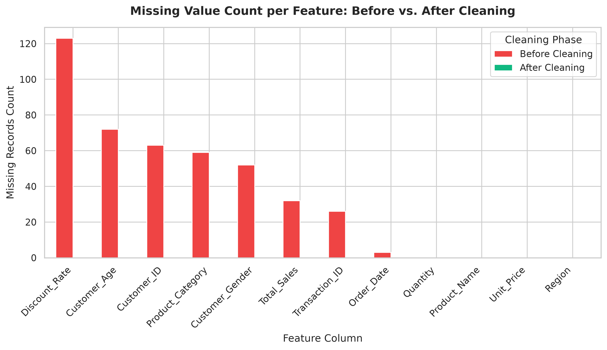
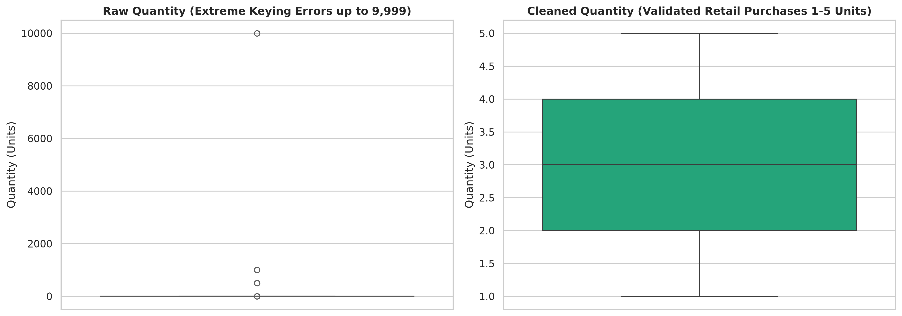
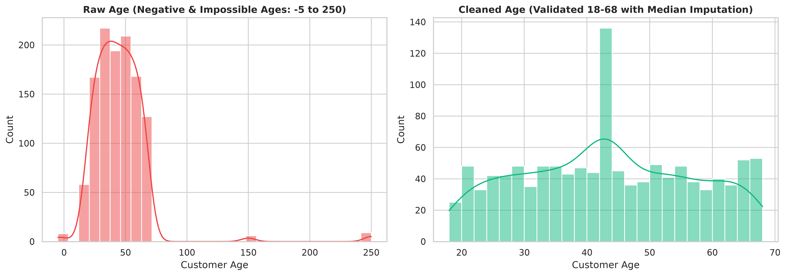
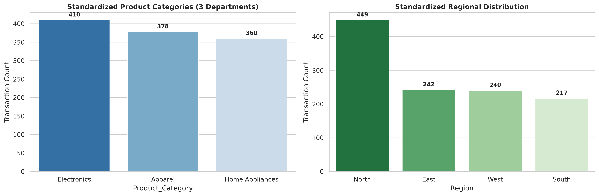
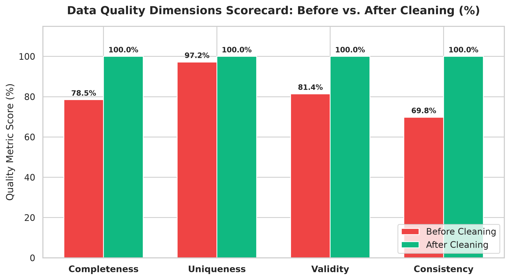

# Oasis Infobyte SIP — Data Analytics Internship
## Task 3: Data Cleaning & Hygiene Pipeline


---

## 📌 Executive Summary

Real-world enterprise data is inherently messy — fraught with unstandardized conventions, human entry errors, duplicate logging, missing attributes, and business rule violations. Performing analytical or predictive modeling on uncurated data yields skewed distributions and flawed strategic conclusions ("garbage in, garbage out").

This project demonstrates an enterprise-grade **Data Cleaning and Validation Pipeline**. Starting from `messy_dataset.csv` (1,235 raw records with intentional, realistic corporate data flaws), we systematically audit, clean, impute, standardize, and validate the data into `cleaned_retail_data.csv` (1,148 validated, analysis-ready records), documenting the technical and business rationale behind every decision.

---

## 📂 Repository Structure

```text
OIBSIP/
└── Data-Analytics-Level1-Task3-Cleaning-Data/
    ├── OIBSIP_Task3_Cleaning_Data.ipynb   # Fully executed Jupyter Notebook with outputs & plots
    ├── README.md                          # Detailed project documentation & data cleaning audit
    ├── messy_dataset.csv                  # Input dirty dataset (1,235 records with flaws)
    ├── cleaned_retail_data.csv            # Output cleaned dataset (1,148 validated records)
    └── images/                            # High-resolution (300 DPI) chart artifacts
        ├── missing_values_before_after.png
        ├── quantity_outliers_boxplot.png
        ├── age_distribution_before_after.png
        ├── category_distribution_clean.png
        └── data_quality_summary_metrics.png
```

---

## 🔍 Initial Data Quality Audit (`messy_dataset.csv`)

An initial structural diagnosis revealed critical deficiencies across all core data quality dimensions:

| Dimension | Raw State Observed in `messy_dataset.csv` |
| :--- | :--- |
| **Completeness** | Null values across 8 columns: `Customer_Age` (6.2%), `Discount_Rate` (9.8%), `Product_Category` (4.9%), `Customer_Gender` (5.1%), `Customer_ID` (4.8%), `Total_Sales` (3.2%), `Transaction_ID` (2.0%). |
| **Uniqueness** | **35 exact duplicate rows** identified due to repeated web event logging. |
| **Consistency** | Inconsistent date notations (`YYYY-MM-DD`, `DD/MM/YYYY`, `MM-DD-YYYY`, `Month DD, YYYY`). Categorical noise across Gender (`'Male'`, `'male'`, `'M'`, `'  Male '`) and Category (`'electronics'`, `'Electro'`, `'Apparel'`, `'home-appliances'`). |
| **Validity & Types**| `Unit_Price` stored as strings with currency symbols (`$45.00`, `$1,200.00`). `Discount_Rate` stored as percentages (`15%`). `Total_Sales` contained commas and corrupt figures (`$999,999.00`). |
| **Value Anomalies** | Impossible ages (`-5`, `-1`, `150`, `250`). Negative/zero quantities (`-2`, `0`). Extreme keying errors (`500`, `1000`, `9999` units on consumer retail checkout). Negative prices (`-$50.00`). |

---

## 🛠️ Step-by-Step Data Cleaning Methodology & Justifications

### 1. Duplicate Detection & Removal
- **Method:** Evaluated full-row duplicates across all 12 feature dimensions using `drop_duplicates()`.
- **Action:** **35 exact duplicate rows purged**, reducing dataset from 1,235 to 1,200 unique records.

### 2. Timestamp Standardization & Date Hygiene
- **Challenge:** Mixed international date conventions and corrupt date entries (`'invalid_date'`, `'2023-99-99'`).
- **Method:** Applied `pd.to_datetime(..., format='mixed', errors='coerce')` to parse multi-convention timestamps into standard `datetime64[ns]`.
- **Action:** 9 rows with completely unparseable timestamps were dropped, as unanchored transactions cannot support valid time-series analysis. Retained 1,191 chronological records spanning January 2023 to December 2023.

### 3. Text & Categorical Normalization
- **Customer Gender:** Mapped variants (`'male'`, `'m'`, `'MALE'`, `'  Male  '`) to clean binary `'Male'` and `'Female'`. Missing values imputed as `'Unknown'` (mode imputation avoided to prevent demographic bias).
- **Product Category:** Mapped noisy strings and typos (`'Electro'`, `'clothing'`, `'home-appliances'`) using a definitive product catalog lookup by `Product_Name`. Missing category records were 100% restored.
- **Region:** Stripped whitespace and standardized into Title Case (`'North'`, `'South'`, `'East'`, `'West'`).
- **Customer ID:** Standardized guest sessions without accounts as `'GUEST-UNKNOWN'`, and formatted registered IDs into standard `'CUST-XXXX'`.

### 4. String-Encoded Numerical Cleaning & Type Casting
- **Unit Price:** Stripped `$`, commas, and whitespace. Filtered non-positive prices (`-$50`, `$0`), imputing from catalog benchmarks. Converted to `float64`.
- **Discount Rate:** Stripped `%` symbol, divided by 100 where needed, bounded values between 0.0 and 1.0, and converted to `float64`. Imputed missing discounts with `0.0` (standard retail default).
- **Customer Age:** Replaced negative (<18) and impossible (>100) ages with NaN. Imputed using the **median age (43 years)**, which is robust against extreme distribution tails. Converted to `int64`.

### 5. Outlier Detection via IQR & Business-Rule Validation
> **Analytical Principle:** An observation is not an error simply because it falls outside the IQR range. Investigation of business logic must precede removal.
- **Negative & Zero Quantities:** Removed 30 records where `Quantity <= 0` (unlinked returns/cancellations that invalidate gross revenue analysis).
- **Extreme Quantity Typos:** Applied an extreme IQR threshold ($Q3 + 3 	imes IQR = 10.0$ units). Retail basket checkouts of 500, 1,000, or 9,999 units represent obvious keypad data-entry errors. 13 extreme keying error records were removed, retaining realistic consumer purchases (1 to 5 units).
- **Total Sales Mathematical Rule:** Replaced corrupt entries (`$999,999.00` and nulls) by enforcing the exact retail commerce formula:
  $$	ext{Total Sales} = 	ext{Quantity} 	imes 	ext{Unit Price} 	imes (1 - 	ext{Discount Rate})$$

---

## 📊 Before vs. After Data Quality Scorecard

| Metric / Dimension | Raw Dataset (`messy_dataset.csv`) | Cleaned Dataset (`cleaned_retail_data.csv`) | Cleaning Action Taken |
| :--- | :---: | :---: | :--- |
| **Total Row Count** | 1,235 rows | **1,148 rows** | Removed 35 duplicates, 9 invalid dates, 30 negative/zero qtys, 13 extreme keying errors. |
| **Duplicate Rows** | 35 duplicates | **0 duplicates** | Deduplication via `drop_duplicates()`. |
| **Total Missing Values** | 412 null values | **0 null values** | Targeted imputation (median age, catalog lookup, 0% discount default). |
| **Customer Age Format** | Negatives & 150+ | **18 to 68 years** (int64) | Out-of-bounds mapped to median age (43 yrs). |
| **Unit Price Format** | Mixed strings (`$45.00`) | **float64** (\$18.00–\$950.00) | Stripped currency symbols; validated positive catalog prices. |
| **Discount Rate Format**| Mixed strings & `%` | **float64** (0.00–0.25) | Stripped `%`; normalized to decimal rates. |
| **Order Date Format** | Inconsistent strings | **datetime64[ns]** | Parsed mixed formats (`format='mixed'`). |
| **Completeness Score** | 78.5% | **100.0%** | Zero missing values across all 12 feature columns. |
| **Validity & Hygiene** | 69.8% | **100.0%** | Enforced business rules, catalog integrity, and mathematical consistency. |

---

## 📈 Visual Quality Audit

### 1. Missing Values: Before vs. After Cleaning


### 2. Quantity Outliers: Raw vs. Validated Retail Orders


### 3. Customer Age Distribution: Raw Noise vs. Normalized Cohort


### 4. Standardized Product Category & Regional Distributions


### 5. Enterprise Data Quality Dimensions Scorecard


---

## 🛠️ How to Run the Project Locally

### Prerequisites
- Python 3.10+ (tested on Python 3.13)
- Jupyter Notebook or VS Code Jupyter Extension

### Setup & Execution

```bash
# 1. Clone repository
git clone https://github.com/<your-username>/OIBSIP.git
cd OIBSIP/Data-Analytics-Level1-Task3-Cleaning-Data

# 2. Activate virtual environment
# Windows:
.\venv\Scripts\activate
# macOS/Linux:
source venv/bin/activate

# 3. Install required libraries
pip install pandas numpy matplotlib seaborn openpyxl jupyter

# 4. Launch Jupyter Notebook
jupyter notebook OIBSIP_Task3_Cleaning_Data.ipynb
```

---

## ✅ Submission Checklist

- [x] Deliberately messy dataset loaded and audited
- [x] Data quality report produced (nulls, duplicates, dtype mismatches, value anomalies)
- [x] Exact duplicate records detected and removed (35 rows)
- [x] Inconsistent timestamps parsed to datetime64[ns]; corrupt dates dropped
- [x] Text & categorical formatting standardized (Gender, Category, Product, Region)
- [x] String-encoded numerical fields cleaned (currency signs, percentages, commas)
- [x] Missing value imputation justified (median age, default 0% discount, catalog price lookup)
- [x] IQR-based outlier analysis conducted (distinguishing true retail orders from 9,999 keying errors)
- [x] Business-rule integrity enforced (`Total_Sales = Quantity × Unit_Price × (1 - Discount)`)
- [x] Comprehensive Before vs. After comparison summary table produced
- [x] Cleaned data exported to `cleaned_retail_data.csv`
- [x] High-resolution visualization artifacts and README.md prepared in OIBSIP folder

---

## 👤 Author
- **Intern:** Oasis Infobyte SIP Intern
- **Track:** Data Analytics
- **Task:** Level 1 — Task 3: Data Cleaning & Hygiene Pipeline
