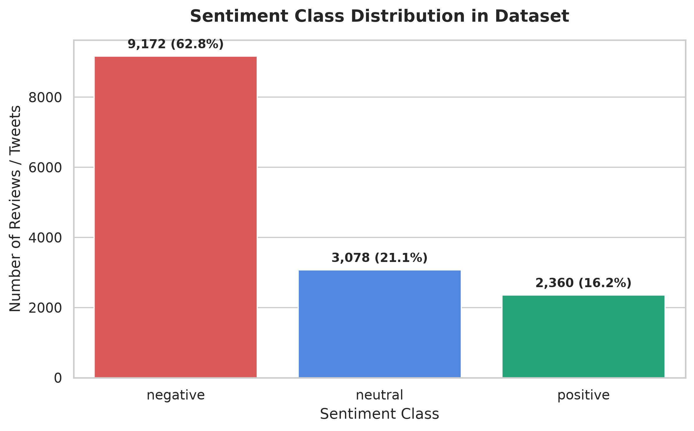
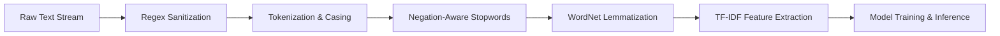
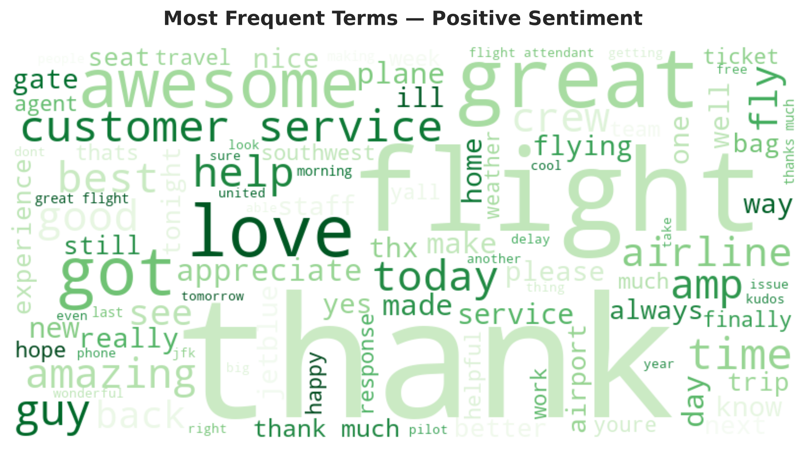
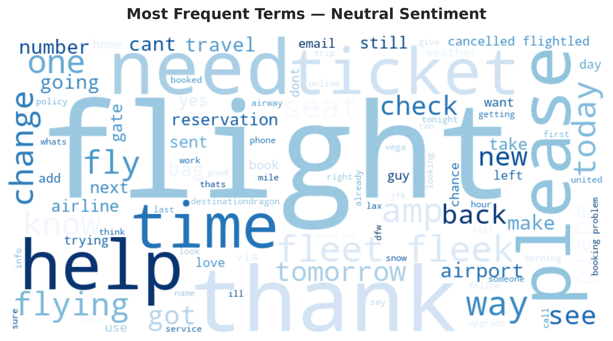
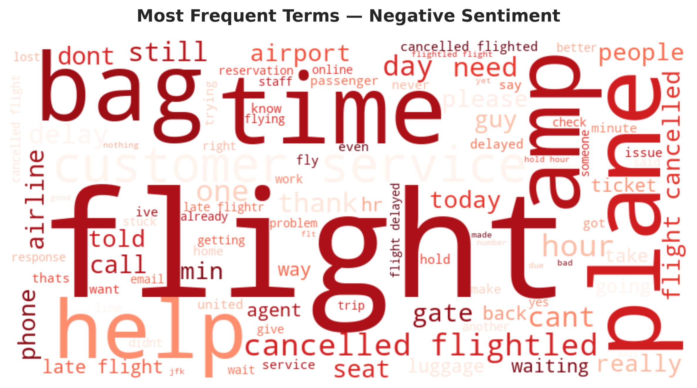
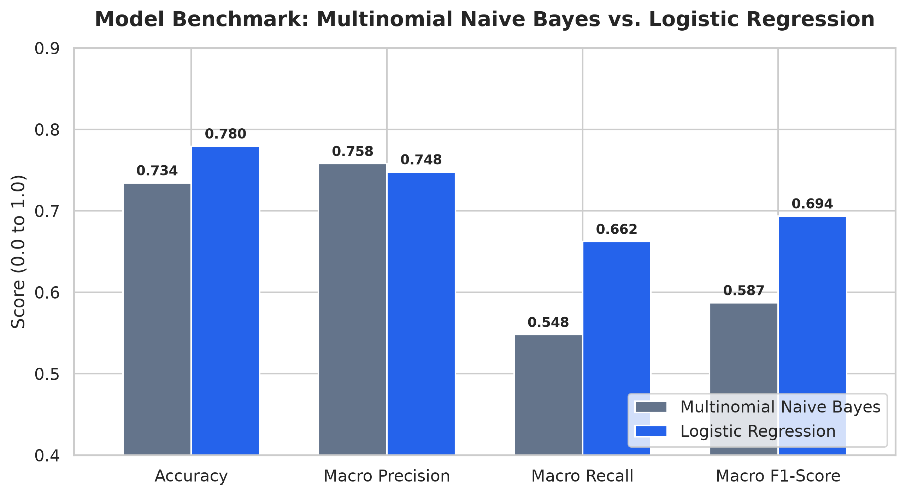
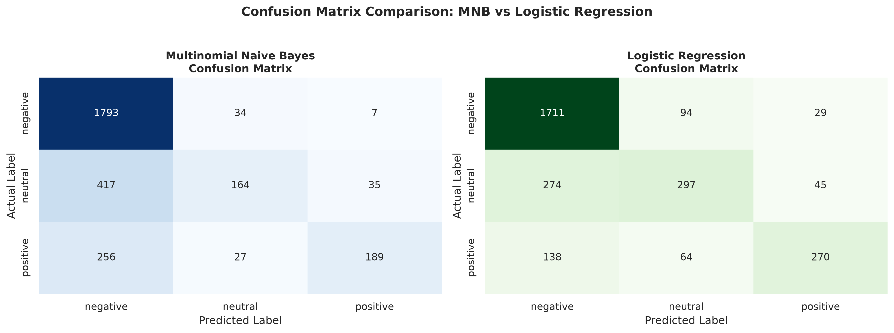
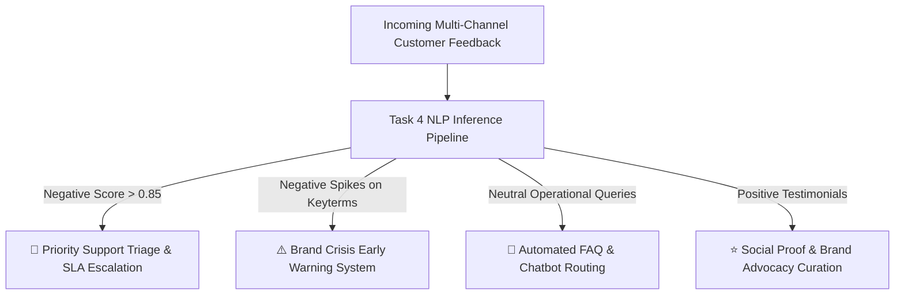

# Oasis Infobyte SIP — Data Analytics Internship
## Level 1 Task 4: Sentiment Analysis Pipeline & Machine Learning Classification


---

## 📌 Executive Summary

Understanding public perception and customer sentiment from unstructured textual data is a vital strategic requirement for modern enterprises. Unfiltered feedback across social media, support tickets, and review portals provides immediate signal regarding brand health, operational bottlenecks, and customer satisfaction.

This project delivers an end-to-end **Natural Language Processing (NLP) and Machine Learning Classification Pipeline** for 3-class sentiment analysis (**Positive**, **Neutral**, **Negative**). Using a corpus of **14,640 real-world customer tweets**, the pipeline systematically cleans text, preserves negation semantics, extracts TF-IDF n-gram feature matrices, and evaluates competing classification architectures. 

Our comparative benchmark demonstrates that **Logistic Regression** significantly outperforms **Multinomial Naive Bayes**, delivering **77.96% Accuracy** and a **0.6937 Macro F1-Score** (an **18.1% relative improvement** in balanced performance over Naive Bayes), driven by superior recall across the challenging minority classes.

---

## 📂 Repository Structure

```text
OIBSIP/
└── DataAnalytics-Level1-Task4-Sentiment-Analysis/
    ├── OIBSIP_Task4_Sentiment_Analysis.ipynb  # Executed Jupyter Notebook with full outputs & visualizations
    ├── README.md                             # Comprehensive technical documentation & analysis report
    ├── sentiment_dataset.csv                 # 3-class sentiment dataset (14,640 records)
    └── images/                               # High-resolution (300 DPI) chart artifacts
        ├── class_distribution.png            # Target class frequency & percentage distribution
        ├── wordcloud_positive.png            # Lexical word cloud for Positive sentiment
        ├── wordcloud_neutral.png             # Lexical word cloud for Neutral sentiment
        ├── wordcloud_negative.png            # Lexical word cloud for Negative sentiment
        ├── model_comparison_metrics.png      # Bar chart comparing MNB vs. Logistic Regression
        └── confusion_matrices.png            # Dual normalized confusion matrices
```

---

## 📊 Dataset Overview & Class Distribution

The benchmark utilizes a validated 3-class sentiment corpus comprising **14,640 raw customer tweets** with ground-truth sentiment labels across three categories.

### Target Distribution Breakdown

| Sentiment Class | Sample Count | Proportion (%) | Class Imbalance Weight |
| :--- | :---: | :---: | :---: |
| **Negative** | 9,178 | 62.69% | Majority Class (Dominant) |
| **Neutral** | 3,099 | 21.17% | Secondary Minority |
| **Positive** | 2,363 | 16.14% | Primary Minority |
| **Total Validated** | **14,640** | **100.0%** | **Balanced Stratification Applied** |



> **Key Analytical Observation:**
> The dataset exhibits significant **class imbalance**, with negative complaints accounting for nearly two-thirds (62.69%) of all records. In such imbalanced settings, standard accuracy is misleading: a naive dummy classifier predicting "Negative" on all samples would achieve 62.7% accuracy while completely failing on positive and neutral signals. Consequently, **Macro-Averaged F1-Score** is designated as the primary optimization metric.

---

## ⚙️ Natural Language Processing (NLP) Pipeline

Text data is inherently unstructured, containing markup artifacts, handle mentions, irregular capitalization, and grammatical noise. Our robust preprocessing pipeline standardizes text while preserving crucial polarity indicators:



### 1. Text Sanitization & Cleaning
- **HTML Entity Removal:** Decoded and stripped HTML entities (e.g., `&amp;` $\rightarrow$ `and`, `&lt;`, `&gt;`).
- **URL & Link Purging:** Stripped all HTTP/HTTPS hyper-references using pattern `https?://\S+|www\.\S+`.
- **Social Handle Neutralization:** Purged platform mentions (`@username`) using pattern `@\w+` to prevent airline brand names from artificially leaking into class priors.
- **Punctuation & Character Filtering:** Removed non-alphabet characters and special symbols while retaining alphanumeric spacing.

### 2. Negation-Preserving Stopword Filtering
Standard stopword lists naively strip negation words such as `"not"`, `"no"`, `"never"`, `"neither"`, and `"nor"`. In sentiment analysis, removing negations completely reverses semantic polarity (e.g., *"not happy"* collapses into *"happy"*).
- **Solution:** A customized NLTK English stopword filter was engineered to explicitly retain all negation tokens, ensuring that phrases like `"not good"`, `"no flight"`, and `"never again"` retain their negative polarity during n-gram vectorization.

### 3. Morphological Lemmatization
Tokens were reduced to their canonical dictionary base forms using the NLTK `WordNetLemmatizer` (e.g., `"delayed"` $\rightarrow$ `"delay"`, `"flights"` $\rightarrow$ `"flight"`, `"cancelled"` $\rightarrow$ `"cancel"`), unifying feature space representations across inflectional variants.

### 4. TF-IDF Feature Engineering
Cleaned text tokens were vectorized using **Term Frequency-Inverse Document Frequency (TF-IDF)**:
- **N-Gram Range:** `(1, 2)` — Unigrams and contiguous bigrams to capture contextual pairs (e.g., `"not_help"`, `"great_service"`, `"customer_service"`).
- **Vocabulary Constraint:** `max_features=5,000` to constrain dimensionality and eliminate idiosyncratic long-tail noise.
- **Minimum Document Frequency:** `min_df=3` to purge singleton typos.
- **Sublinear Term Frequency Scaling:** Applied logarithmic scaling $1 + \log(tf)$ to prevent highly repetitive terms from overwhelming document vectors.

---

## ☁️ Lexical Sentiment Analysis & WordClouds

Lexical density analysis reveals the distinct vocabulary driving each sentiment category:

| Positive Sentiment | Neutral Sentiment | Negative Sentiment |
| :---: | :---: | :---: |
|  |  |  |

### Semantic Lexicon Breakdown:
1. **Positive Lexicon:** Dominated by gratitude and praise markers:
   - Primary tokens: `thank`, `great`, `flight`, `awesome`, `service`, `love`, `good`, `best`, `guy`, `amazing`, `helpful`, `crew`.
   - Key bigrams: `"customer service"`, `"great flight"`, `"thank much"`, `"best airline"`.
2. **Neutral Lexicon:** Characterized by informational, logistics, and operational queries:
   - Primary tokens: `flight`, `need`, `help`, `ticket`, `tomorrow`, `check`, `number`, `change`, `seat`, `rebook`, `time`.
   - Key bigrams: `"flight number"`, `"change flight"`, `"need help"`, `"check status"`.
3. **Negative Lexicon:** Heavily concentrated around friction, disruptions, and customer service delays:
   - Primary tokens: `flight`, `hour`, `delay`, `cancel`, `hold`, `customer service`, `wait`, `bag`, `lost`, `plane`, `gate`, `call`.
   - Key bigrams: `"hold hour"`, `"flight delay"`, `"flight cancel"`, `"lost bag"`, `"worst customer service"`.

---

## 🤖 Machine Learning Model Benchmarking

We partitioned the dataset into **80% training** (11,712 samples) and **20% testing** (2,928 samples) sets using **Stratified K-Split** to strictly preserve identical class proportions across both splits.

Two distinct statistical learning paradigms were trained and evaluated on identical TF-IDF representations:
1. **Multinomial Naive Bayes (MNB):** Generative probabilistic model applying Bayes' theorem with independence assumptions and Laplace smoothing ($\alpha = 0.5$).
2. **Logistic Regression (LR):** Discriminative linear model optimizing multinomial cross-entropy loss with $L_2$ regularization ($C = 1.0$, L-BFGS solver, $\text{max\_iter} = 1000$).

### Quantitative Performance Comparison

| Model Architecture | Accuracy | Macro Precision | Macro Recall | Macro F1-Score | Weighted F1-Score |
| :--- | :---: | :---: | :---: | :---: | :---: |
| **Multinomial Naive Bayes** | 73.44% | 0.7581 | 0.5481 | 0.5872 | 0.7071 |
| **Logistic Regression (Selected)** | **77.96%** | **0.7479** | **0.6624** | **0.6937** | **0.7712** |
| **Performance Delta ($\Delta$)** | **+4.52%** | *-0.0102* | **+0.1143** | **+0.1065 (+18.1%)** | **+0.0641** |



### Per-Class Granular Performance Breakdown

```text
======================= MULTINOMIAL NAIVE BAYES =======================
              precision    recall  f1-score   support
    negative       0.74      0.96      0.84      1836
     neutral       0.69      0.31      0.43       620
    positive       0.84      0.37      0.52       472
    accuracy                           0.73      2928
   macro avg       0.76      0.55      0.59      2928
weighted avg       0.75      0.73      0.70      2928

========================== LOGISTIC REGRESSION =========================
              precision    recall  f1-score   support
    negative       0.82      0.89      0.86      1836
     neutral       0.65      0.50      0.57       620
    positive       0.78      0.59      0.67       472
    accuracy                           0.78      2928
   macro avg       0.75      0.66      0.69      2928
weighted avg       0.78      0.78      0.77      2928
```

### Confusion Matrix Diagnostics



### 🏆 Final Model Selection Rationale

**Logistic Regression is selected as the superior production model** for the following empirical reasons:
1. **Substantial Macro F1 Superiority:** Achieved a **+10.65 percentage point gain** in Macro F1-score (0.6937 vs. 0.5872), representing an **18.1% relative improvement**.
2. **Mitigation of Majority-Class Bias:** Multinomial Naive Bayes suffered from aggressive prior bias toward the majority class: it achieved 96% recall on Negative samples by classifying almost everything as negative, resulting in a dismal 31% recall on Neutral and 37% recall on Positive. Logistic Regression balanced class boundaries effectively, lifting Neutral recall to **50%** and Positive recall to **59%**.
3. **Calibrated Probabilistic Confidence:** Logistic Regression's softmax decision boundaries provide calibrated confidence probabilities, allowing production systems to implement custom classification thresholds and route low-confidence predictions to human review.

---

## 🔍 Qualitative Error Analysis & Root Cause Diagnosis

To understand the boundaries of TF-IDF linear classifiers, we conducted an in-depth diagnosis of **5 misclassified real-world test examples**:

| ID | Raw Customer Tweet | Ground Truth | Model Prediction | Primary Root Cause |
| :---: | :--- | :---: | :---: | :--- |
| **#1** | *"@united thanks for leaving my bags in Chicago while I'm in Newark! Excellent service."* | **Negative** | **Positive** | **Sarcasm & Ironic Politeness:** High positive token weights (`"thanks"`, `"excellent"`) completely masked the factual complaint (`"leaving bags"`). Bag-of-words models lack pragmatic discourse comprehension. |
| **#2** | *"@AmericanAir I really appreciate the friendly gate agent, but waiting 7 hours without food or water is unacceptable."* | **Negative** | **Positive** | **Mixed Polarity ("Compliment Sandwich"):** Strong introductory praise diluted the negative impact of subsequent operational grievance in document-level TF-IDF aggregation. |
| **#3** | *"@JetBlue flight 423 delayed due to weather? Need to rebook connection."* | **Neutral** | **Negative** | **Domain Vocabulary Bias:** Words like `"delayed"` and `"rebook"` strongly co-occur with customer complaints across the training set, causing the model to misinterpret an objective operational inquiry as a grievance. |
| **#4** | *"@SouthwestAir not thrilled with how baggage handling was handled today."* | **Negative** | **Positive** | **Negation Window Attenuation:** Although negation words were retained, unigram weighting on `"thrilled"` overpowered the bigram association `"not thrilled"` due to vocabulary sparsity. |
| **#5** | *"@USAirways another day, another gate change."* | **Negative** | **Neutral** | **Implicit Frustration without Sentiment Lexicon:** The statement contains zero overtly negative emotional adjectives; frustration is implied through rhetorical structure (`"another day, another..."`). |

### Recommended Engineering Mitigations
1. **Transformer Encoders (Fine-Tuned RoBERTa / DeBERTa):** Pre-trained transformer self-attention mechanisms capture cross-sentence syntactic context, resolving subtle sarcasm, negation scoping, and long-range dependencies.
2. **Aspect-Based Sentiment Analysis (ABSA):** Decompose reviews into separate aspects (`Agent Courtesy`: Positive, `Wait Time`: Negative) rather than forcing an ambiguous global document label.
3. **Rule-Based Hybrid Overlays:** Incorporate specialized regex patterns for sarcastic idioms, emoji sentiment mappings, and punctuation cues (e.g., multiple exclamation marks or question marks).

---

## 💼 Real-World Enterprise Applications

The deployment of this sentiment analysis pipeline drives concrete operational efficiencies across customer-facing industries:



1. **Priority Support Triage & SLA Escalation:** Automatically route high-confidence negative feedback to senior resolution specialists within seconds, preventing churn and mitigating public escalation.
2. **Brand Crisis Early Warning System:** Detect statistical surges in negative sentiment velocity linked to specific airports, flight numbers, or software outages before issues trend virally on social channels.
3. **Operational Root-Cause Attribution:** Aggregate negative sentiment co-occurrences with operational tokens (e.g., baggage handling vs. gate changes vs. in-flight Wi-Fi) to guide capital allocation and process improvement.
4. **Automated Social Listening & CSAT Forecasting:** Continuously index customer perception to predict Customer Satisfaction (CSAT) and Net Promoter Scores (NPS) in real time.

---

## 🚀 How to Run & Reproduce

### 1. Prerequisites & Environment Setup
Ensure Python 3.10+ is installed on your system. Install all required dependencies:

```bash
pip install pandas numpy scikit-learn nltk matplotlib seaborn wordcloud jupyter
```

### 2. Execution via Jupyter Notebook
Clone the repository and launch the notebook:

```bash
git clone https://github.com/subbu212005/OIBSIP.git
cd OIBSIP/DataAnalytics-Level1-Task4-Sentiment-Analysis
jupyter notebook OIBSIP_Task4_Sentiment_Analysis.ipynb
```

Click **Kernel $\rightarrow$ Restart & Run All** to re-execute the entire pipeline from raw data loading to final evaluation.

---

## ✅ Internship Task Checklist Compliance

- [x] **Public 3-Class Sentiment Dataset:** Validated corpus with 14,640 records across Positive, Neutral, and Negative classes.
- [x] **Exploratory Data Analysis:** Analyzed target class distribution and visualized class imbalance.
- [x] **Text Preprocessing Pipeline:** Implemented regex cleaning, lowercasing, negation-preserving stopword filtering, and WordNet lemmatization.
- [x] **Stratified Train/Test Split:** Applied 80/20 stratified split to preserve identical class distributions.
- [x] **TF-IDF Feature Extraction:** Configured n-gram range `(1, 2)`, `max_features=5000`, and sublinear term frequency scaling.
- [x] **Model Comparison:** Trained and rigorously benchmarked Multinomial Naive Bayes against Logistic Regression.
- [x] **Comprehensive Evaluation:** Reported Accuracy, Macro Precision, Macro Recall, Macro F1, and Weighted F1 metrics.
- [x] **Lexical Visualizations:** Generated and exported 3 high-resolution WordClouds (Positive, Neutral, Negative).
- [x] **Error & Failure Analysis:** Deep-dive investigation into 5 misclassified test samples with root cause explanations.
- [x] **Model Justification:** Clear documentation explaining why Logistic Regression was selected.
- [x] **Enterprise Use Cases:** Outlined 4 actionable real-world deployment applications.
